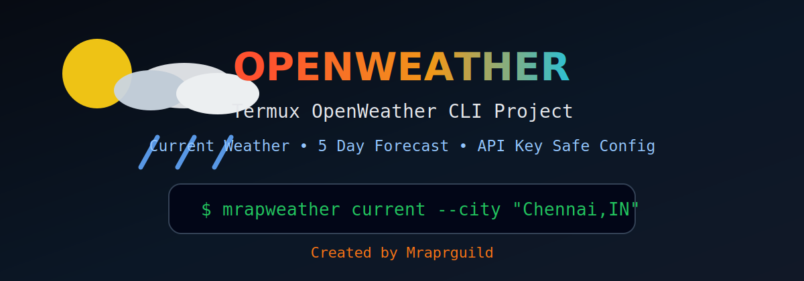
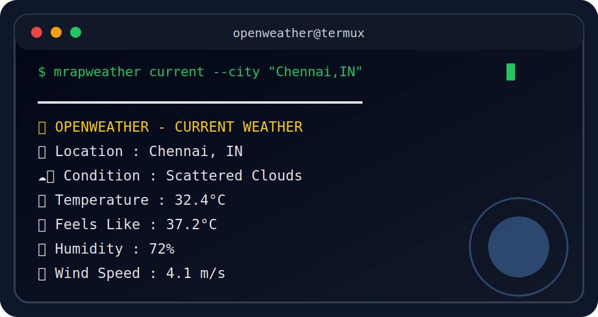
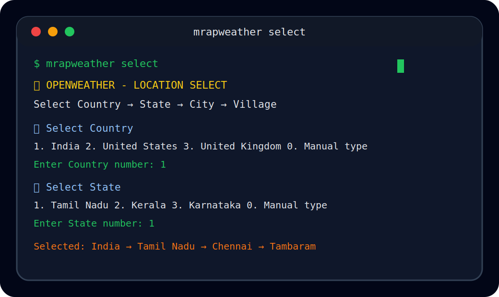

<p align="center">
  
</p>

<h1 align="center">🌦 Openweather</h1>

<p align="center">
  <b>Premium Termux weather CLI project by Mraprguild</b>
</p>

<p align="center">
  
  
  
  
</p>

<p align="center">
  <a href="#-termux-install">Install</a> •
  <a href="#-add-api-key">API Key</a> •
  <a href="#-commands">Commands</a> •
  <a href="#-preview">Preview</a> •
  <a href="#-github-upload">GitHub Upload</a>
</p>

---

## 🚀 About

**Openweather** is a clean, fast, and stylish **Termux weather command line tool** powered by the **OpenWeather API**.

It supports:

```text
✅ Current weather
✅ 5 day / 3 hour forecast
✅ City and country code search
✅ Latitude / longitude weather
✅ Celsius, Fahrenheit, Kelvin
✅ Country / State / City / Village select menu
✅ Safe local API key storage
✅ No external Python packages
```

---

## 📸 Preview

<p align="center">
  
</p>

---

## 📁 Project Structure

```text
openweather-termux/
├── weather.py
├── install.sh
├── uninstall.sh
├── scripts/
│   └── mrapweather-key
├── assets/
│   ├── banner.svg
│   └── terminal-preview.svg
├── screenshot.svg
├── LICENSE
├── .gitignore
└── README.md
```

---


<p align="center">
  
</p>

## 🧭 Country / State / City / Village Select

Run interactive Termux selector:

```bash
mrapweather select
```

The menu shows:

```text
Country → State → City → Village / Area
```

Example Termux flow:

```text
🌦  OPENWEATHER - LOCATION SELECT
Select Country → State → City → Village

📌 Select Country
1. India
2. United States
3. United Kingdom
0. Manual type

Enter Country number: 1

📌 Select State
1. Tamil Nadu
2. Kerala
3. Karnataka
0. Manual type

Enter State number: 1

📌 Select City
1. Chennai
2. Madurai
3. Coimbatore
4. Salem
0. Manual type

Enter City number: 1

Select village/area also? [Y/n]: y

📌 Select Village / Area
1. Adyar
2. Anna Nagar
3. Tambaram
4. Velachery
5. Porur
0. Manual type

Enter Village / Area number: 3
```

Then select:

```text
1. Current weather
2. Forecast
```

### Add more villages

Edit:

```bash
nano data/locations.json
```

Add your own country, state, city, village / area list.

---

## 📱 Termux Install

```bash
pkg update -y && pkg upgrade -y
pkg install -y git python
git clone https://github.com/Mraprguild/openweather-termux.git
cd openweather-termux
chmod +x install.sh
./install.sh
```

---

## 🔑 Add API Key

Get your API key from OpenWeather, then save it safely:

```bash
mrapweather-key YOUR_OPENWEATHER_API_KEY
```

Example:

```bash
mrapweather-key 1234567890abcdef1234567890abcdef
```

Your key is saved locally:

```bash
~/.config/mrapweather/config.env
```

> ⚠️ Do not upload your real API key to GitHub.

---

## 🌦 Commands

### Current weather

```bash
mrapweather current --city "Chennai,IN"
```

### Interactive location selector

```bash
mrapweather select
```

### 5 day / 3 hour forecast

```bash
mrapweather forecast --city "Chennai,IN" --limit 10
```

### Weather by latitude and longitude

```bash
mrapweather current --lat 13.0827 --lon 80.2707
```

### Forecast by coordinates

```bash
mrapweather forecast --lat 13.0827 --lon 80.2707 --limit 12
```

---

## 🌡 Unit Options

### Celsius

```bash
mrapweather current --city "Chennai,IN" --units metric
```

### Fahrenheit

```bash
mrapweather current --city "London,GB" --units imperial
```

### Kelvin

```bash
mrapweather current --city "Tokyo,JP" --units standard
```

---

## 🧪 Test Without Install

```bash
export OPENWEATHER_API_KEY="YOUR_OPENWEATHER_API_KEY"
python weather.py current --city "Chennai,IN"
```

---

## 🛠 Error Fix

### Missing API key

```bash
mrapweather-key YOUR_OPENWEATHER_API_KEY
```

### Invalid API key

```bash
mrapweather-key NEW_OPENWEATHER_API_KEY
```

### City not found

Use country code:

```bash
mrapweather current --city "Salem,IN"
```

### Network problem

```bash
pkg update -y
ping google.com
```

---

## 🧹 Uninstall

```bash
cd openweather-termux
chmod +x uninstall.sh
./uninstall.sh
```

---

## 🔐 Security

Never commit real API keys.

Safe:

```bash
~/.config/mrapweather/config.env
```

Unsafe:

```bash
README.md
weather.py
public GitHub commits
```

---

## 🌍 Example Cities

```bash
mrapweather current --city "Chennai,IN"
mrapweather current --city "Madurai,IN"
mrapweather current --city "Bengaluru,IN"
mrapweather current --city "Delhi,IN"
mrapweather current --city "London,GB"
mrapweather current --city "Tokyo,JP"
```

---


## 🔁 Replace GitHub Project

```bash
pkg update -y && pkg install -y git unzip
cd ~
unzip -o openweather-termux-location-select.zip
cd openweather-termux
git init
git branch -M main
git remote remove origin 2>/dev/null
git remote add origin https://github.com/Mraprguild/openweather-termux.git
git add .
git commit -m "Add OpenWeather location selector"
git push -u origin main --force
```

---

## 🚀 GitHub Upload

```bash
git init
git add .
git commit -m "Initial Openweather Termux OpenWeather project"
git branch -M main
git remote add origin https://github.com/Mraprguild/openweather-termux.git
git push -u origin main
```

---

## ✨ Branding

```text
Project : Openweather
Author  : Mraprguild
Platform: Termux
API     : OpenWeather
License : MIT
```

---

<p align="center">
  <b>Made with ❤️ by Mraprguild</b>
</p>

<p align="center">
  
</p>
